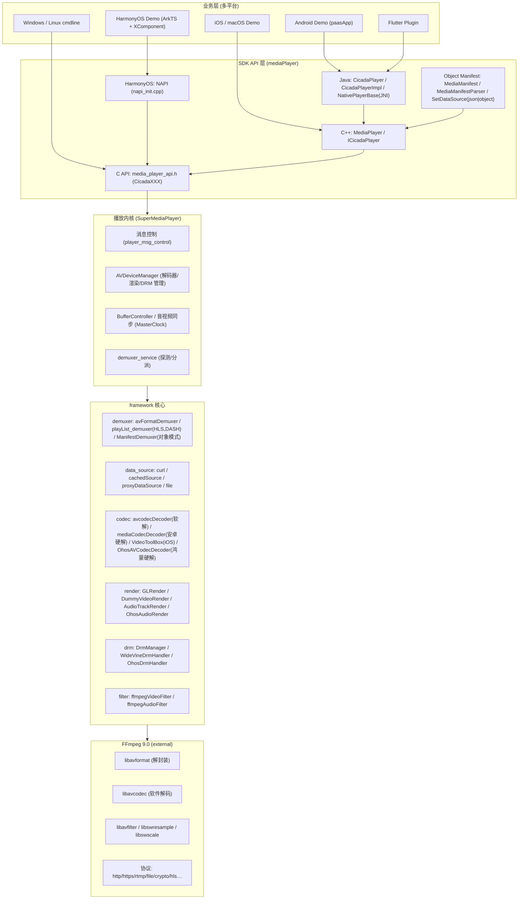
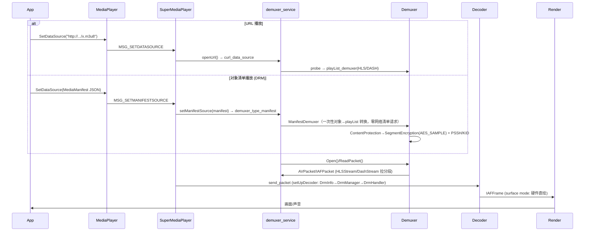
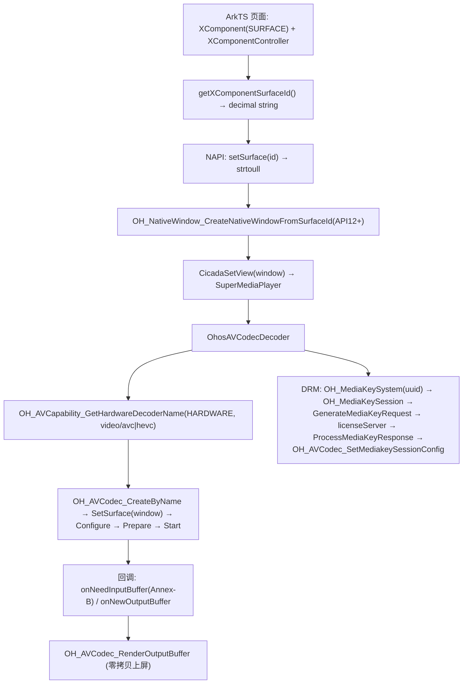

# CicadaPlayerNext 架构图与模块说明

> 本文档描述升级到 **FFmpeg 9.0**、支持 **Android 7.0+ (API 24)**、**HarmonyOS NEXT (API 12+)**
> 硬件加速与**对象清单播放（DRM）**之后的整体架构。

## 1. 总体架构



## 2. 数据流（URL 模式 vs 对象清单模式）



## 3. 对象清单播放管线（对应 hili-player 的 manifest-to-hls/dash）

```mermaid
flowchart LR
    JSON["MediaManifest JSON<br/>(video[]/audio[]/periods[]<br/>contentProtection[]/licenseServer<br/>encryption(AES-128)…)"]
    PARSER["MediaManifestParser<br/>(CicadaJSON 一次性解析)"]
    STRUCT["Cicada::Manifest::MediaManifest<br/>(C++ 结构体)"]
    CONV["ManifestDemuxer<br/>(一次转换: 与 manifest-to-hls.ts /<br/>manifest-to-dash.ts 同语义)"]
    PL["内部 playList 对象模型<br/>Period→AdaptationSet→Representation→SegmentList"]
    MGR["HLSManager (DRM 能力管线)<br/>HLSStream + SegmentTracker"]
    DRM["SegmentEncryption:<br/>AES-128→软件分段解密<br/>AES_SAMPLE+keyFormat→DrmHandler<br/>(Widevine/FairPlay/ClearKey/OHOS DRM Kit)"]

    JSON --> PARSER --> STRUCT --> CONV --> PL --> MGR --> DRM
```



转换规则与 Web 端完全对齐：
- `mode: template` → `*` 通配符展开成分片 URL（`media`/`initialization` 推导）；
- `mode: list` → 显式分片列表（`byteRange` 映射 `setByteRange`）；
- `mode: single` → init/索引字节范围（SegmentBase 语义）；
- URL 解析：绝对/根路径原样返回，相对路径拼 `baseUrl`；
- `encryption.expiresIn > 0` → 密钥改从 `licenseServer.url` 获取；
- `contentProtection` 第一个可用系统（Widevine/ClearKey/FairPlay/PlayReady）→
  `SegmentEncryption{AES_SAMPLE, keyFormat=schemeIdUri, keyUrl=laUrl|licenseServer.url, pssh, keyId}`
  → `Stream_meta.keyFormat/keyUrl/drmPssh/drmKeyId` → `DrmManager` → 各平台 DrmHandler。

## 4. 硬件解码矩阵

| 平台 | 视频硬解 | 音频输出 | DRM |
|---|---|---|---|
| Android 7.0+ | MediaCodec (surface mode) | AudioTrack | Widevine L1/L3 (DrmManager) |
| iOS / macOS | VideoToolbox | AudioQueue/AudioUnit | FairPlay (keyFormat 通道) |
| HarmonyOS NEXT | **OH_AVCodec 硬解 (surface mode, 零拷贝)** | **OH_AudioRenderer** | **DRM Kit: OH_MediaKeySystem/Session + SetMediakeySessionConfig** |
| Windows | D3D11VA (FFmpeg hwaccel) | SDL | – |
| Linux | VAAPI/VDPAU (FFmpeg hwaccel) | SDL/ALSA | – |
| WebAssembly | 软件解码 | Web Audio | – |

## 5. 鸿蒙平台硬件解码栈



## 6. 目录结构（新增/修改要点）

```
CicadaPlayerNext/
├── external/
│   ├── player_git_source_list.sh        # FFMPEG_BRANCH=n9.0, patch 默认关闭
│   └── player_ffmpeg_config.sh          # FFmpeg 9 组件清单
├── build_tools/
│   ├── ffmpeg_commands.sh               # 移除 --enable-avresample
│   ├── ffmpeg_cross_compile_config.sh   # + ffmpeg_cross_compile_set_OHOS
│   ├── AndroidConfig.sh                 # 现代 NDK clang + API 24
│   ├── OHOSConfig.sh                    # 鸿蒙 NDK 交叉编译环境
│   ├── build_ohos.sh                    # 鸿蒙外部库一键编译
│   ├── common_build.sh                  # clang 链接 + link_shared_lib_OHOS
│   └── boost/user-config-Android.jam    # clang/libc++ toolset
├── framework/
│   ├── HarmonyOS.cmake                  # 鸿蒙平台配置
│   ├── demuxer/manifest/                # ★ 对象清单播放
│   │   ├── MediaManifest.h              #   统一清单 C++ 结构
│   │   ├── MediaManifestParser.cpp      #   JSON ↔ 结构
│   │   └── ManifestDemuxer.cpp          #   对象 → playList 一次转换
│   ├── codec/OHOS/OhosAVCodecDecoder.*  # ★ 鸿蒙硬解
│   ├── render/audio/OHOS/OhosAudioRender.*  # ★ 鸿蒙音频
│   ├── drm/OHOS/OhosDrmHandler.*        # ★ 鸿蒙 DRM Kit
│   └── utils/ffmpeg_utils.c             # FFmpeg 9 API 迁移
├── mediaPlayer/
│   ├── ICicadaPlayer.h / MediaPlayer.h / media_player_api.h   # + SetDataSource(manifest/json)
│   ├── SuperMediaPlayer.* / player_msg_control.* / SMPMessageControllerListener.*
│   └── player_types.h                   # + manifest 成员
├── platform/
│   ├── Android/…                        # minSdk 24 + setDataSourceManifest(JNI)
│   ├── Flutter/…                        # minSdk 24
│   └── HarmonyOS/                       # ★ 鸿蒙 Demo (hvigor + NAPI)
└── docs/                                # ★ 本文档集
```
